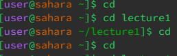
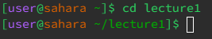
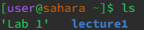
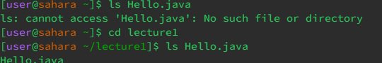
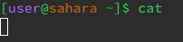
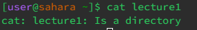
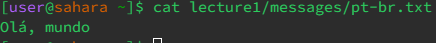

# Report #1
## cd
1. No arguments
   

The working directory at the time was /home. As you can see the reason that we got that output is become when the cd command is run, it returns to /home. As such, it is not an error.
   
2. Directory as an argument

The working directory at the time was /home. The reason why this is the output is due to the fact that cd stands for change directory, so giving a directory as an argument changes to that directory. As such, it is not an error.

3. File as an argument
   
 

The working directory at the time was /home/lecture1/messages. The reason why this is the output is due to the fact that cd only works on directories. As a file is not a directory, it throws up an error that says it isn't a directory.

## ls
1. No arguments

The working directory at the time was /home. The reason this is what ls with no argument is because it lists everything in that directory, in this case being the lecture1 folder and the Lab 1 file. As a resul, this is not an error.

2. Directory as an argument
   

The working directory at the time was /home. The reason this is what ls with a directory as an argument outputs is because lists what is in the directory that is used as the argument. Thus, it lists everthing that is in the directory so it isn't an error.

3. File as an argument

The working directory at the time was either /home/lecture1. The reason for this output is that it lists the file that is used as an argument and nothing else. Thus, it isn't an error.

## cat
1. No arguments

The working directory at the time was /home. The reason for this output is that cat stands for concatenate, with no argument it requires an input from you. Thus, it isn't an error even if it isn't what you expected.
   
2. Directory as an argument

The working directory at the time was /home. The reason for this output is that cat cannot display the contents of the file because the argument is not a file. Since the argument isn't a file, it throws up an error saying that the argument is a directory.
   
4. File as an argument
   

The working directory at the time /home. The reason for this output is that cat displays the contents of the file. Since the argument is a file, it displays what is in the "pt-br" file. Thus, this isn't an error.
