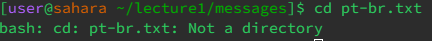

# Report #1
## cd
1. No arguments
   

   
3. Directory as an argument

3. File as an argument
   
 

## ls
1. No arguments

2. Directory as an argument

3. File as an argument

## cat
1. No arguments
   
2. Directory as an argument
   
3. File as an argument
   
