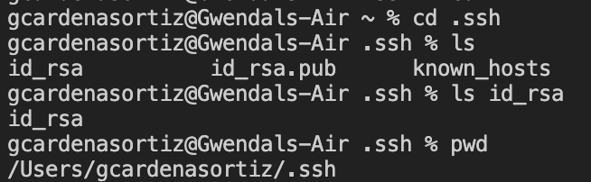
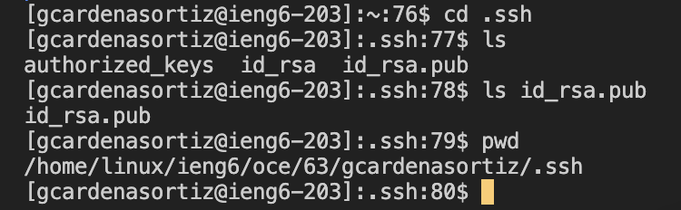
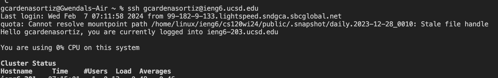

# Report #2
## Part 1
**My Code**

**Message 1**

 

Both methods, `handleRequest` and my `main` method, were called. My code only needs two separate arguments to work properly, the first argument in this case is the url `localhost:1600/add-message?s=Hello&user=Me`. The second argument is for my `main` method when I run my server. When I run it by typing `java ChatServer 1600` in the terminal, the argument is the `1600` contained in `args` which states what port it will use. Before this request is sent through, the field `str` is an empty string as `""`. However, after this request is sent through `str` becomes `"Me: Hello\n"`. The other relevant field is my array of String arrays `newParameters`, for this specific request `newParameters` contains `[["s", "Hello"], ["user", "Me"]]`.

**Message 2**

Both methods, `handleRequest` and my `main` method, were called. My code only needs two separate arguments to work properly, the first argument in this case is the url `localhost:1600/add-message?s=Whats%20good&user=Myself`. The second argument is for my `main` method when I first ran my server. When I ran it by typing `java ChatServer 1600` in the terminal, the argument is the `1600` contained in `args` which states what port it will use. Before this request is sent through, the field `str` was the previous added to string `"Me: Hello\n"`. However, after it is sent through `str` becomes `"Me: Hello\nMyself: Whats good\n"`. The other relevant field which is my array of String arrays `newParameters` gets initialized again so when this code runs `newParameters` contains `[["s", "Whats good"], ["user", "Myself"]]`.

## Part 2
**Absolute path to private key**

**Absolute path to public key**

**Terminal Interaction**

## Part 3
**What I learned**

I ended up learning a lot this week and last week. Specifically about the `ssh` command, which allows you to access a remote server through your computer. For example, for Lab 2 and as well as Lab 3 we utilized it to log into our `ieng6` account by following the following notation: `yourusername@ieng6.ucsd.edu`.
