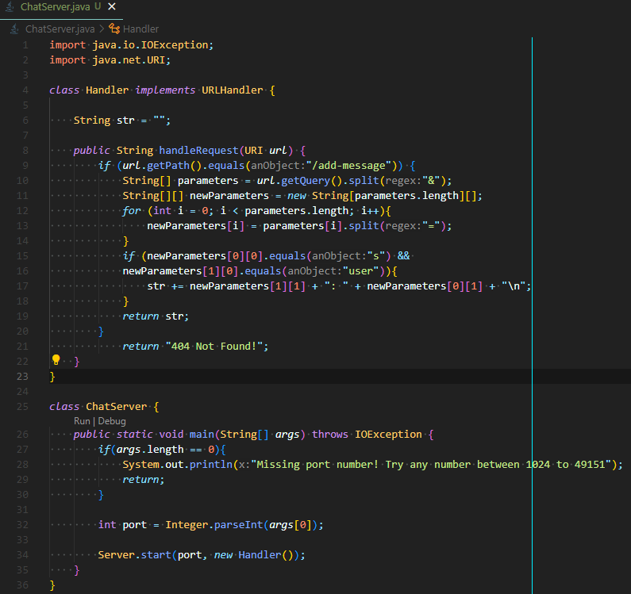

# Report #2
## Part 1
   

 

Both methods, handleRequest and my main method, were called. My code only needs two separate arguments to work properly, the first argument in this case is the url `localhost:1600/add-message?s=Hello&user=Me`. The second argument is for my main method when I run my server. When I run it by typing `java ChatServer 1600` in the terminal, the argument is the 1600 contained in `args` which states what port it will use. Before this request is sent through, the field `str` is an empty string as `""`. However, after it is sent through `str` becomes `"Me: Hello\n"`. Other relevant fields is my array of String arrays `newParameters`, when this code runs `newParameters` contains `[["s", "Hello"], ["user", "Me"]]

Both methods, handleRequest and my main method, were called. My code only needs two separate arguments to work properly, the first argument in this case is the url `localhost:1600/add-message?s=Whats%20good&user=Myself`. The second argument is for my main method when I first ran my server. When I ran it by typing `java ChatServer 1600` in the terminal, the argument is the 1600 contained in `args` which states what port it will use. Before this request is sent through, the field `str` was an empty string as `"Me: Hello\n"`. However, after it is sent through `str` becomes `"Me: Hello\n"Myself: Whats good\n`.

The working directory at the time was `/home`. As you can see the reason that we got that output is become when the `cd` command is run, it returns to `/home`. As such, it is not an error.
## Part 2

## Part 3
