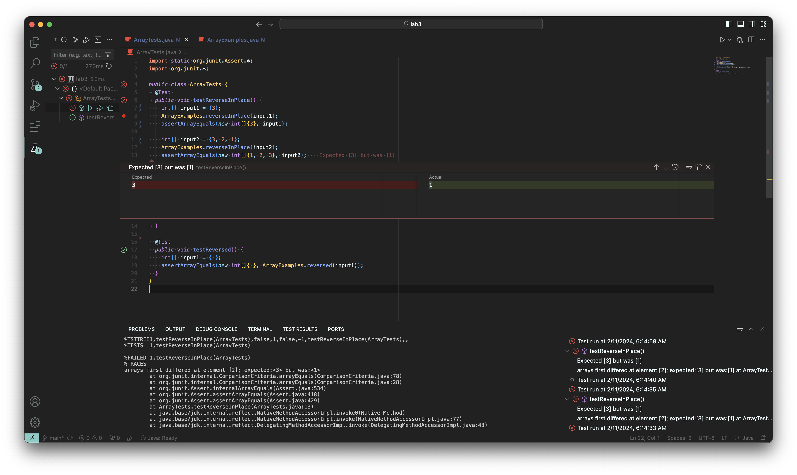

# Report #3
## Part 1
**Failure Inducing Input**
```
@Test 
public void testReverseInPlace() {
  ...

  int[] input2 = {3, 2, 1};
  ArrayExamples.reverseInPlace(input2);
  assertArrayEquals(new int[]{1, 2, 3}, input2);
}
```

The second input seems to fail due to a flawed implementation of the reverseInPlace method.

**Successful Input**
```
@Test 
public void testReverseInPlace() {
  int[] input1 = {3};
  ArrayExamples.reverseInPlace(input1);
  assertArrayEquals(new int[]{3}, input1);

  ...
}
```

However, the first input of this test seems to work just fine.

**Symptom**



As you can see, there seems to be an issue with assigning the new values to their respective spots in the array in our method when we run the test that contains the above two inputs. 

**Bug Fix**

Before fixing it:
```
static void reverseInPlace(int[] arr) {
    for(int i = 0; i < arr.length; i++) {
      arr[i] = arr[arr.length - i - 1];
    }
}
```
After fixing it:
```
static void reverseInPlace(int[] arr) {
    for(int i = 0; i < arr.length / 2; i++) {
      int temp = arr[i];
      arr[i] = arr[arr.length - i - 1];
      arr[arr.length - i - 1] = temp;
    }
}
```

The issue was the logic behind overwriting the elements in the array. Before the array would use an already overwrittten element. However, by cutting the iterations in half and storing the value of the original index temporarily it allows us to succesfully overwrite each element without crossing over.

## Part 2
### The find command

**mtime**
```
find ./ -mtime -7                        
./
.//government
.//government/About_LSC
.//government/About_LSC/LegalServCorp_v_VelazquezSyllabus.txt
.//government/About_LSC/Progress_report.txt
.//government/About_LSC/Strategic_report.txt
.//government/About_LSC/Comments_on_semiannual.txt
.//government/About_LSC/Special_report_to_congress.txt
.//government/About_LSC/CONFIG_STANDARDS.txt
.//government/About_LSC/commission_report.txt
.//government/About_LSC/LegalServCorp_v_VelazquezDissent.txt
.//government/About_LSC/ONTARIO_LEGAL_AID_SERIES.txt
.//government/About_LSC/LegalServCorp_v_VelazquezOpinion.txt
.//government/About_LSC/diversity_priorities.txt
.//government/About_LSC/reporting_system.txt
.//government/About_LSC/State_Planning_Report.txt
.//government/About_LSC/Protocol_Regarding_Access.txt
...
```
The `mtime` option for the `find` command is useful for finding any files or directories that we might want to find that were modifed in the last certain amount of days. For example in this one, I can see what was modified in the last 7 days by writing `-mtime -7`. I was able to find this option to utilize through `man find`.

```
find ./ -mtime -1
.//government/Media
```
The `mtime` option for the `find` command is useful for finding any files or directories that we might want to find that were modifed in the last certain amount of days. For example in this one, I can see what was modified in the last day by writing `-mtime -1`. I was able to find this option to utilize through `man find`.

**type**
```
gcardenasortiz@Gwendals-Air technical % find ./ -type f
.//government/About_LSC/LegalServCorp_v_VelazquezSyllabus.txt
.//government/About_LSC/Progress_report.txt
.//government/About_LSC/Strategic_report.txt
.//government/About_LSC/Comments_on_semiannual.txt
.//government/About_LSC/Special_report_to_congress.txt
.//government/About_LSC/CONFIG_STANDARDS.txt
.//government/About_LSC/commission_report.txt
.//government/About_LSC/LegalServCorp_v_VelazquezDissent.txt
.//government/About_LSC/ONTARIO_LEGAL_AID_SERIES.txt
...
```
The `-type` option for the `find` command is useful for finding what we are looking for. In this case, we are trying to find only the files in a given directory. I was able to learn how to utilize by using `man find`.

```
gcardenasortiz@Gwendals-Air technical % find ./ -type d
./
.//government
.//government/About_LSC
.//government/Env_Prot_Agen
.//government/Alcohol_Problems
.//government/Gen_Account_Office
.//government/Post_Rate_Comm
.//government/Media
.//plos
.//biomed
.//911report
```
The `-type` option for the `find` command is useful for finding what type of thing we are looking for. In this case, we are trying to find only the directories in a given directory. I was able to learn how to utilize it by using `man find`.

**size**
```
gcardenasortiz@Gwendals-Air technical % find ./ -size -100G
./
.//government
.//government/About_LSC
.//government/About_LSC/LegalServCorp_v_VelazquezSyllabus.txt
.//government/About_LSC/Progress_report.txt
.//government/About_LSC/Strategic_report.txt
.//government/About_LSC/Comments_on_semiannual.txt
...
```
The `-size` option for the `find` command is useful for find anything that is equal, above, or below a certain size. In this case, we are trying to find only the things that are less than 100 Gigabytes. I was able to utilize this through `man find`.

```
gcardenasortiz@Gwendals-Air technical % find ./ -size +70k
.//government/About_LSC/commission_report.txt
.//government/About_LSC/State_Planning_Report.txt
.//government/Env_Prot_Agen/multi102902.txt
.//government/Env_Prot_Agen/ctf7-10.txt
.//government/Env_Prot_Agen/ctf1-6.txt
.//government/Env_Prot_Agen/ctm4-10.txt
.//government/Env_Prot_Agen/atx1-6.txt
.//government/Env_Prot_Agen/bill.txt
.//government/Env_Prot_Agen/tech_adden.txt
.//government/Alcohol_Problems/Session3-PDF.txt
.//government/Alcohol_Problems/Session4-PDF.txt
.//government/Gen_Account_Office/d0269g.txt
...
```
The `-size` option for the `find` command is useful for find anything that is equal, above, or below a certain size. In this case, we are trying to find only the things that are more than 70 Kilobytes. I was able to utilize this through `man find`.

**maxdepth**
```
gcardenasortiz@Gwendals-Air technical % find ./ -maxdepth 1 -name "rr171.txt"
```
The `-maxdepth` option for the `find` command is useful for searching for a certain file/files or directory within a certain depth. In this case, we are trying to find the file `rr171.txt` within one level of the current directory but since it is deeper than that it is not returned. I was able to learn how to utilize it through `man find`.

```
gcardenasortiz@Gwendals-Air technical % find ./ -maxdepth 2 -name "rr171.txt"
.//biomed/rr171.txt
```
The `-maxdepth` option for the `find` command is useful for searching for a certain file/files or directory within a certain depth. In this case, we are trying to find the file `rr171.txt` within two levels of the current directory and since it was contained within the search level it was returned. I was able to learn how to utilize it through `man find`.
